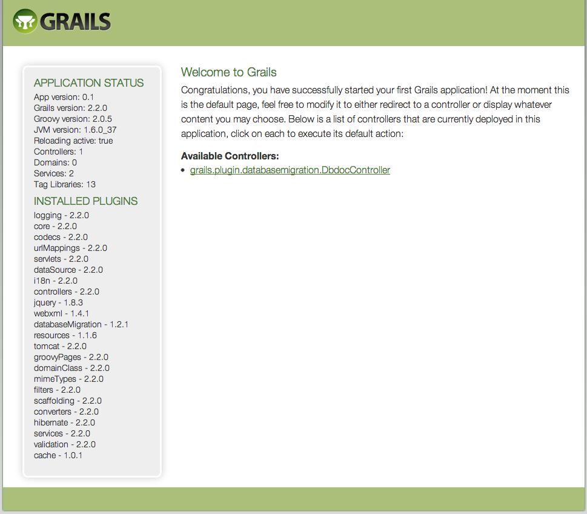

.. index::
   single: Day 1: Starting up the Project

Day 1: Starting up the Project
==============================

Requirements
````````````

Java
''''

Grails is JVM based framework, so all you need at the moment is Java. In your console/terminal type:

.. code-block:: bash

    java -version

Output should be similar to this:

.. code-block:: text

    java version "1.6.0_37"
    Java(TM) SE Runtime Environment (build 1.6.0_37-b06-434-11M3909)
    Java HotSpot(TM) 64-Bit Server VM (build 20.12-b01-434, mixed mode)

If you don't have java installed, please install latest Java.

You also need to make sure that you have JAVA_HOME set up in your shell. OS X users can add this line into your ~/.profile file:

.. code-block:: bash

    # http://stackoverflow.com/questions/1348842/what-should-i-set-java-home-to-on-osx
    export JAVA_HOME=$(/usr/libexec/java_home)

To verify if you have JAVA_HOME set, you can type in your terminal:

.. code-block:: bash

    echo $JAVA_HOME

You should get path to your JAVA_HOME location, similar to this one:

.. code-block:: text

    /System/Library/Java/JavaVirtualMachines/1.6.0.jdk/Contents/Home

Grails
''''''

To install Grails, we'll use GVM_, which is the easiest and preferred way to install Grails on you machine.

.. _GVM: http://gvmtool.net/

Installing is as simple as:

.. code-block:: bash

    curl -s get.gvmtool.net | bash && \
    source ~/.gvm/bin/gvm-init.sh

Verify GVM installation by typing:

.. code-block:: bash

    gvm help

If you get "command not found" message, it means something went wrong. In this case check GVM_ website for help.

If you GVM is installed, we can install Grails now. We'll use the latest one (2.2.0 as of this writing). Type the following command:

.. code-block:: bash

    gvm install grails

Verify Grails by typing:

.. code-block:: bash

    grails -version

You should get:

.. code-block:: text

    Grails version: 2.2.0

Initializing the Project Directory
``````````````````````````````````

Assuming that you want to have your project in "projects" folder under your home directory, type:

.. code-block:: bash

    cd ~/projects && \
    grails create-app jobeet && \
    cd jobeet

File structure looks like this:

.. code-block:: bash

    ls -l

.. code-block:: text

    total 24
    drwxr-xr-x  11 janusz developers  374 Feb 18 11:40 .
    drwxr-xr-x   3 janusz developers  102 Feb 18 11:40 ..
    -rw-r--r--   1 janusz developers  109 Feb 18 11:40 application.properties
    drwxr-xr-x  10 janusz developers  340 Dec 20 13:55 grails-app
    drwxr-xr-x   2 janusz developers   68 Feb 18 11:40 lib
    drwxr-xr-x   2 janusz developers   68 Feb 18 11:40 scripts
    drwxr-xr-x   4 janusz developers  136 Feb 18 11:40 src
    drwxr-xr-x   4 janusz developers  136 Feb 18 11:40 test
    drwxr-xr-x   7 janusz developers  238 Dec 20 13:55 web-app

Project Setup/Creation
``````````````````````

The generated application already have default directory structure, here is the brief description:

+------------------------+------------------------------------------------------------------------------+
| Directory              | Description                                                                  |
+========================+==============================================================================+
| grails-app             | In Grails you can only have one application and it sits in this directory    |
+------------------------+------------------------------------------------------------------------------+
| lib                    | contains jars of third party libraries                                       |
+------------------------+------------------------------------------------------------------------------+
| src                    | This is where you put your code, which is not directly related to Grails app |
+------------------------+------------------------------------------------------------------------------+
| scripts                | @todo                                                                        |
+------------------------+------------------------------------------------------------------------------+
| tests                  | This is where you put your unit and integration tests                        |
+------------------------+------------------------------------------------------------------------------+
| web-app                | public folder html/css/js files                                              |
+------------------------+------------------------------------------------------------------------------+
| application.properties | Grails meta file                                                             |
+------------------------+------------------------------------------------------------------------------+

Directory Structure Permissions
```````````````````````````````

Default is fine. No need to change anything.

Web Server Configuration
````````````````````````

There is no need to do it, as Grails comes with build-in Tomcat app server server, which is what you need for development.

Test the New Configuration
``````````````````````````

To start your local application you need to issue following command (it may take a while, as it need to download some libs):

.. code-block:: bash

    grails

This will start interactive Grails console. And while you're in this console, you can start you application, by typing "run-app":

.. code-block:: text

    grails> run-app

    | Server running. Browse to http://localhost:8080/jobeet
    | Application loaded in interactive mode. Type 'stop-app' to shutdown.
    | Enter a script name to run. Use TAB for completion:

This command will start local Tomcat server and bind it to port 8080, so you can access it via browser at http://localhost:8080/jobeet. Now you should see the Grails Welcome screen. Well, at least I can see it :-)



The "run-app" command creates new process on your machine, to stop it you need to issue "stop-app" command. To exit Grails interactive console use Ctrl+C.

Managing Grails project with Version Control Systems
````````````````````````````````````````````````````

Git
'''

To initialize your git repository, use:

.. code-block:: bash

    git init

Also make sure you add grails .gitignore file:

.. code-block:: bash

    curl -o .gitignore https://raw.github.com/github/gitignore/master/Grails.gitignore && \
    git add .gitignore

To add Grails app related files and create initail commit, use:

.. code-block:: bash

    git add -A && \
    git commit -m "Initial commit"

Final Thoughts
``````````````

Grails is easier to set up than Symfony, all you need is java, curl, unzip and (optionally) git. The fact that you don't
need to configure directory permissions and server setting is a big win. Simple *run-app* gets you going.