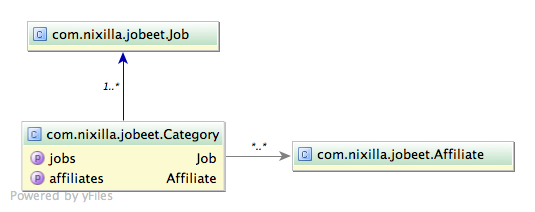
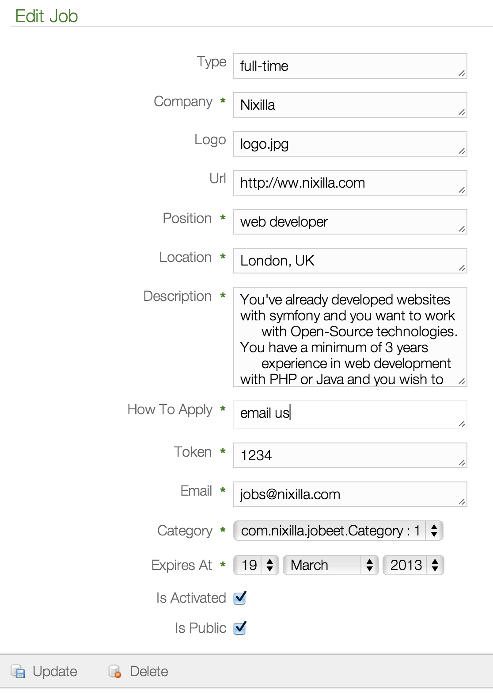

.. index::
   single: Day 3: The Data Model

Day 3: The Data Model
=====================

Every modern framework uses ORM these days. Grails has it's own ORM called GORM.
It's very similar to Doctrine 1.2 as well as Doctrine 2.

Some notable differences include:

1. Domain classes instead of model classes. What's originally is called model class in Doctrine, Grails named domain class.
2. Unlike Doctrine, GORM uses the same classes for Table methods in Doctrine 1.2 or Repository methods in Doctrine 2.
   So instead of PHP/Doctrine approach:

   .. code-block:: php

    <?php
    # Doctrine 1.2
    JobeetJobTable::getInstance()->findAllByCompany('Nixilla');

    # Doctrine 2
    $em->getRepository('Jobeet\Job')->findByCompany('Nixilla');

   in GORM you use static methods of the same domain class

   .. code-block:: groovy

    Job.findByCompany('Nixilla')

   .. note:: In Doctrine 1.2 you need to use findAllBy to get all items for given query and findBy to get a single result.
          In Doctrine 2 and GORM findBy will give you all items and findOneBy will give you single item.

The Relational Model
````````````````````

We're not going to change the data model, so it will be (almost) the same as in original Symfony book.
Unilike Doctrine 1.2, Doctrine 2 and GORM are handling many-to-many relations in different way.
They also create link table to handle many-to-many relation, but this table is not accessible to programmer as class/object.
Simply saying, there is no JobeetCategoryAffiliate class, but there is a jobeet_category_affiliate table in database.



We'll try to use build in timestamping from Grails, while we're not going to change the database model.

The Schema
``````````

Unlike in Symfony 1.4/Doctrine 1.2 you define your schema in plain Groovy file. Similarly to Doctrine 2 approach,
you create plain Groovy classes which represent records in your database.

To create model classes in Grails you can use grails command:

.. code-block:: text

    grails> create-domain-class com.nixilla.jobeet.Job
    | Created file grails-app/domain/com/nixilla/jobeet/Job.groovy
    | Created file test/unit/com/nixilla/jobeet/JobTests.groovy
    grails> create-domain-class com.nixilla.jobeet.Category
    | Created file grails-app/domain/com/nixilla/jobeet/Category.groovy
    | Created file test/unit/com/nixilla/jobeet/CategoryTests.groovy
    grails> create-domain-class com.nixilla.jobeet.Affiliate
    | Created file grails-app/domain/com/nixilla/jobeet/Affiliate.groovy
    | Created file test/unit/com/nixilla/jobeet/AffiliateTests.groovy


We've just created empty domain classes. As you can see Grails encourages us to write tests and created tests
for our domain classes. Of course these are empty tests, you need fill them up with the code.

Now lets add fields to your domain class Job, please open Job.groovy file in your favorite editor.
It's located in grails-app/domain/com/nixilla/jobeet/Job.groovy - it should look like this one:

.. code-block:: groovy

    package com.nixilla.jobeet

    class Job {

        static constraints = {
        }
    }

Let's add fields and constraints

.. code-block:: groovy

    // grails-app/domain/com/nixilla/jobeet/Job.groovy
    package com.nixilla.jobeet

    class Job {

        String type
        String company
        String logo
        String url
        String position
        String location
        String description
        String howToApply
        String token
        Boolean isPublic = true
        Boolean isActivated = false
        String email
        Date expiresAt

        Date dateCreated
        Date lastUpdated

        static belongsTo = [ category: Category ]

        static constraints = {
            type maxSize: 255, nullable: true
            company maxSize: 255, blank: false
            logo maxSize: 255, nullable: true
            url maxSize: 255, url: true, nullable: true
            position maxSize: 255, blank: false
            location maxSize: 255, blank: false
            description maxSize: 4000, blank: false
            howToApply maxSize: 4000, blank: false
            token maxSize: 255, blank: false, unique: true
            email maxSize: 255, blank: false, email: true
        }

        static mapping = {
            table 'jobeet_job'
            version false
            dateCreated column: 'created_at'
            lastUpdated column: 'updated_at'
            howToApply column: 'how_to_apply'
            isPublic column: 'is_public'
            isActivated column: 'is_activated'
            expiresAt column: 'expires_at'
        }
    }

As you see the schema configuration is the same as in original Jobeet tutorial. You can see that field definition is
spread across 3 sections: class fields, constrains and mapping. Ideally we would like to see if the Grails application
we're building here will work with original Jobeet database. So we're building drop-in replacement app.

Let's add other fields

.. code-block:: groovy

    // grails-app/domain/com/nixilla/jobeet/Category.groovy
    package com.nixilla.jobeet

    class Category {

        String name

        Date dateCreated
        Date lastUpdated

        static hasMany = [ jobs: Job, affiliates: Affiliate ]

        static constraints = {
            name maxSize: 255, blank: false, unique: true
        }

        static mapping = {
            table 'jobeet_category'
            version false
            dateCreated column: 'created_at'
            lastUpdated column: 'updated_at'
        }
    }

.. code-block:: groovy

    // grails-app/domain/com/nixilla/jobeet/Affiliate.groovy
    package com.nixilla.jobeet

    class Affiliate {

        String url
        String email
        String token
        Boolean isActive = false

        Date dateCreated
        Date lastUpdated

        static hasMany = [ categories: Category ]
        static belongsTo = Category

        static constraints = {
            url maxSize: 255, url: true, nullable: true
            email maxSize: 255, blank: false, email: true, unique: true
            token maxSize: 255, blank: false, unique: true
        }

        static mapping = {
            table 'jobeet_affiliate'
            version false
            dateCreated column: 'created_at'
            lastUpdated column: 'updated_at'
            isActive column: 'is_active'
        }
    }

The Database
````````````

Similarly to PHP, Groovy has drivers for all major database backends. However unlike PHP, they're not build-in.
You need to explicitly include driver in your project. It's very easy - you just add single line in to the dependency
section in your BuildConfig.groovy file.

.. code-block:: groovy

    // grails-app/conf/BuildConfig.groovy

    grails.project.dependency.resolution = {

        // some other stuff here

        dependencies {
            // for mysql use
            runtime 'mysql:mysql-connector-java:5.1.22'
            // for postgresql use
            runtime 'postgresql:postgresql:9.1-901.jdbc4'
            // for sqlite use
            runtime 'org.xerial:sqlite-jdbc:3.7.2'
        }

        // some other stuff here
    }

You can find your latest dependencies at `Maven Repository`_

.. _Maven Repository: http://mvnrepository.com

Second step is to configure database credentials in your Grails project. You do it by editing DataSource.groovy
- the equivalent of config/databases.yml in Symfony

.. code-block:: groovy

    // grails-app/conf/DataSource.groovy
    dataSource {
        pooled = true
        driverClassName = "org.h2.Driver"
        username = "sa"
        password = ""
    }
    hibernate {
        cache.use_second_level_cache = true
        cache.use_query_cache = false
        cache.region.factory_class = 'net.sf.ehcache.hibernate.EhCacheRegionFactory'
    }
    // environment specific settings
    environments {
        development {
            dataSource {
                dbCreate = "create-drop" // one of 'create', 'create-drop', 'update', 'validate', ''
                url = "jdbc:h2:mem:devDb;MVCC=TRUE;LOCK_TIMEOUT=10000"
            }
        }
        test {
            dataSource {
                dbCreate = "update"
                url = "jdbc:h2:mem:testDb;MVCC=TRUE;LOCK_TIMEOUT=10000"
            }
        }
        production {
            dataSource {
                dbCreate = "update"
                url = "jdbc:h2:prodDb;MVCC=TRUE;LOCK_TIMEOUT=10000"
                pooled = true
                properties {
                   maxActive = -1
                   minEvictableIdleTimeMillis=1800000
                   timeBetweenEvictionRunsMillis=1800000
                   numTestsPerEvictionRun=3
                   testOnBorrow=true
                   testWhileIdle=true
                   testOnReturn=true
                   validationQuery="SELECT 1"
                }
            }
        }
    }

If you want to work with MySQL in this project change environments development section to:

.. code-block:: groovy

    // grails-app/conf/DataSource.groovy
    environments {
        development {
            dataSource {
                dbCreate = "update" // one of 'create', 'create-drop', 'update', 'validate', ''
                url = "jdbc:mysql://localhost:3306/jobeet"
                username = "root"
                password = "mYsEcret"
            }
        }
        test {}
        production {}
    }

Unfortunately, Grails does not provide you with command or tool to create database from Grails environment.
There is no *doctrine:create-db*. You need to create database using mysql cli or any other tool:

.. code-block:: sql

    CREATE DATABASE jobeet;

The dbCreate variable in DataSources defines the way Grails updates your database structure (from Grails manual):

* **create** - Drops the existing schema, creates the schema on startup, dropping existing tables, indexes, etc. first.
* **create-drop** - Same as create, but also drops the tables when the application shuts down cleanly.
* **update** - Creates missing tables and indexes, and updates the current schema without dropping any tables or data. Note that this can't properly handle many schema changes like column renames (you're left with the old column containing the existing data).
* **validate** - Makes no changes to your database. Compares the configuration with the existing database schema and reports warnings.
* any other value - does nothing

For development I suggest to use **update**.

The ORM
```````

Command *doctrine:build --model* does not exist in Grails. You already have all your classes you need. Unlike Doctrine 1.2
there is no base classes to extend from.

.. code-block:: groovy

    def job = new Job()
    job.position = 'Web developer'
    job.save()

    println job.position

    job.delete()

You can also define foreign keys directly by linking objects together:

.. code-block:: groovy

    def category = new Category()
    category.name = 'Programming'

    // you can also pass the field value via constructor
    category = new Category(name: 'Programming')

    def job = new Job()
    job.addToCategories(category)

In the examples above it may look like I'm setting values by accessing object fields directly, but this is not true.
Groovy creates getX and setX methods for each class field, and calling ``category.name = value`` is equivalent to
``category.setName(value)``. But more on this later in Appendix.

Command *doctrine:build --sql* is not needed, as Grails automatically executes this SQL when application starts for the first time.

The Initial Data
````````````````

If you don't have a lot of data or your data are essential to you application and you need to load them on application start,
Bootstrap.groovy is the right place for it. Here we add the fixed list of 4 categories.

.. code-block:: groovy

    // grails-app/conf/BootStrap.groovy
    import com.nixilla.jobeet.Category

    class BootStrap {

        def init = { servletContext ->

            def designCategory = Category.findOrSaveByName('Design')
            def programmingCategory = Category.findOrSaveByName('Programming')
            def managerCategory = Category.findOrSaveByName('Manager')
            def administratorCategory = Category.findOrSaveByName('Administrator')

        }
        def destroy = {
        }
    }

As you can see there is also destroy closure, where you can remove data, you've added on application start.

If you have more data, and you don't want to put it to your BootStrap.groovy file, you can... @todo

See it in Action in the Browser
```````````````````````````````

In Symfony 1.4 each application is devided into **modules**. Symfony module is a directory where you put your controllers, views and config related to particular
functionality i.e. blog, contact form, rss feed. However, if you want you can put all into one module, and it'll be ok too. I've seen this approach quite often.

Grails approach is very similar, however file structure is bit different. All controllers are stored in
``grails-app/controllers``, all views - in ``grails-app/views``

The equivalent of ``doctrine:generate-module`` can be ``create-controller``:

.. code-block:: text

    grails> create-controller com.nixilla.jobeet.Job
    | Created file grails-app/controllers/com/nixilla/jobeet/JobController.groovy
    | Created file grails-app/views/job
    | Created file test/unit/com/nixilla/jobeet/JobControllerSpec.groovy

As you can see Grails also creates tests for us as well as views folder. Have a look on JobController.groovy

.. code-block:: groovy

    // grails-app/controllers/com/nixilla/jobeet/JobController.groovy
    package com.nixilla.jobeet

    class JobController {

        def index() { }
    }

This controller has only one action - *index*, which doesn't do anything yet. We want basic functionality as provided by Symfony.
Therefore let's amend one line:

.. code-block:: groovy

    // grails-app/controllers/com/nixilla/jobeet/JobController.groovy
    package com.nixilla.jobeet

    class JobController {

        def scaffold = true
    }

Now start (or restart) your application:

.. code-block:: text

    grails> stop-app
    grails> run-app
    | Server running. Browse to http://localhost:8080/jobeet
    | Application loaded in interactive mode. Type 'stop-app' to shutdown.
    | Enter a script name to run. Use TAB for completion:

And navigate to ``http://localhost:8080/jobeet/job``



As you can see on the image, the Category item is displayed as ``com.nixilla.jobeet.Category: 1``.
This is because we haven't implemented ``toString`` method yet. Groovy provides basic toString implementation containing
class name and id, which is not as useful as Doctrine guessing method. Add following ``toString`` method to all your
3 domain classes under existing ``mapping`` block.

.. code-block:: groovy

    // grails-app/domain/com/nixilla/jobeet/Category.groovy
    package com.nixilla.jobeet

    class Category {
        static mapping = {
            // ...
        }

        String toString() {
            name
        }
    }

    // grails-app/domain/com/nixilla/jobeet/Job.groovy
    package com.nixilla.jobeet

    class Job {
        static mapping = {
            // ...
        }

        String toString() {
            sprintf('%1$s at %2$s (%3$s)', position, company, location);
        }
    }

    // grails-app/domain/com/nixilla/jobeet/Affiliate.groovy
    package com.nixilla.jobeet

    class Affiliate {
        static mapping = {
            // ...
        }

        String toString() {
            url
        }
    }

.. note:: As you probably noticed there is no **return** keyword in toString method. This is because in Groovy every
          function/method returns the result of the last line of its code. So the **return** keyword is optional.

You can now create, edit and delete jobs. If you leave a required field blank, validation kicks in. That's right - you
already defined validation rules in the static constraints block in the domain class.

.. note:: Note that Grails is bit smarter than Symfony, as it automatically hides dateCreated and lastUpdated form the form.
          In Symfony you have to explicitly unset this in Form class.


Final Thoughts
``````````````

Both frameworks are great, there are some features where Symfony 1.4 is better, and some,  where Grails is better.
For example I like Symfony's:

* modules, where you can group functionality based on common purpose,
* control that Symfony gives you when creating or dropping database, generating SQL, etc.
* build in support for loading/dumping fixtures

On the other hand I prefer Grails':

* domain classes with static class level dynamic finders instead of Doctrine's Table classes,
* Groovy constructors where you can pass value for any field in the object,
* way of hiding the link table in many-to-many relation (same as Doctrine 2)
* support for TDD development by creating test for any artifact you create

But most important - you can see that these frameworks are no so different. I'd even say that
Grails is somewhere between Symfony 1.4 and Symfony 2.x in terms of structure.